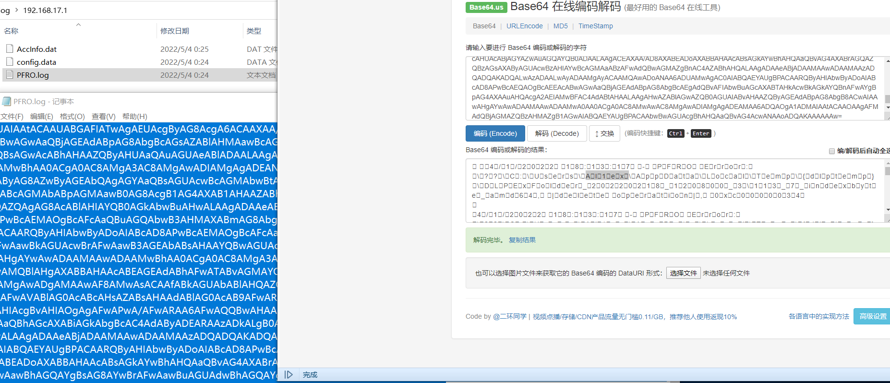
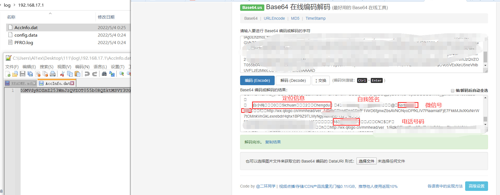
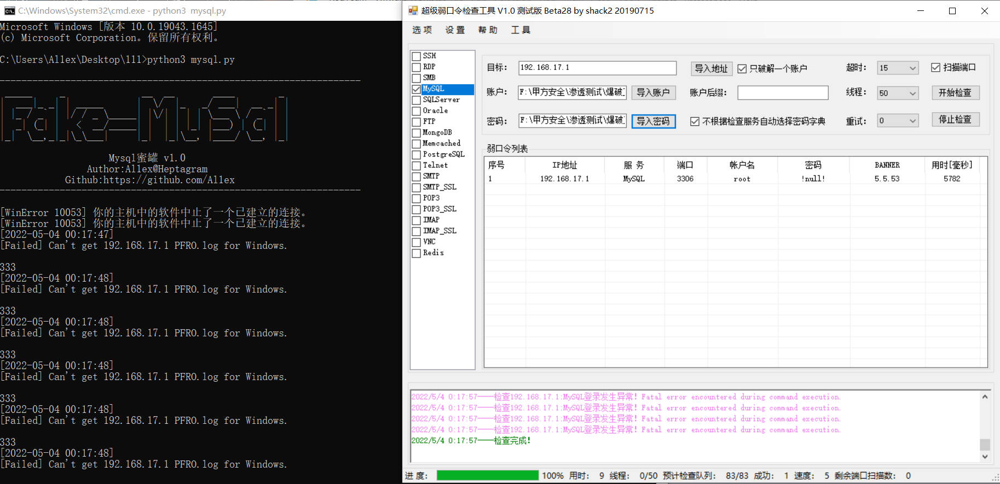
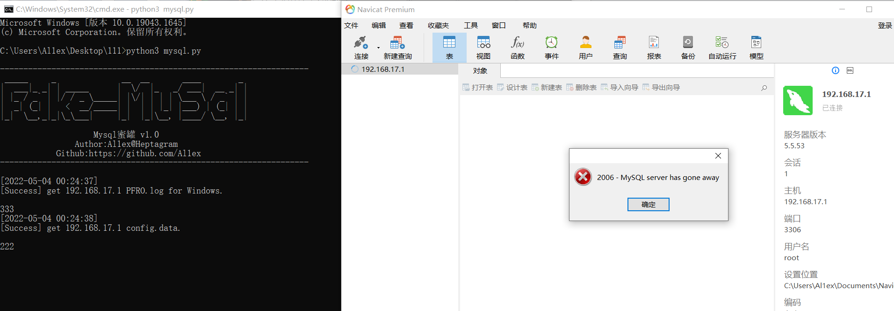
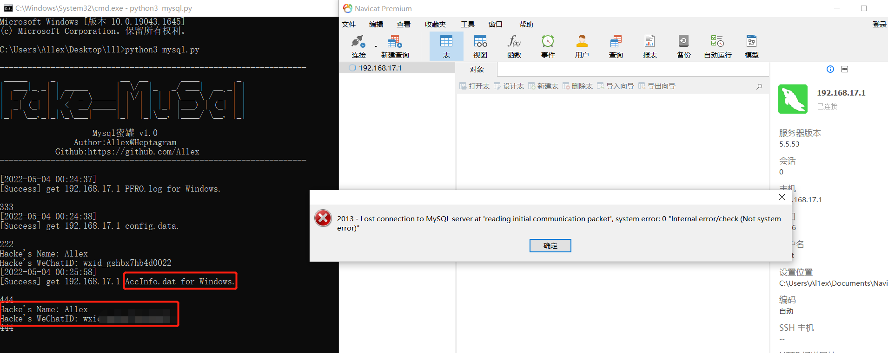
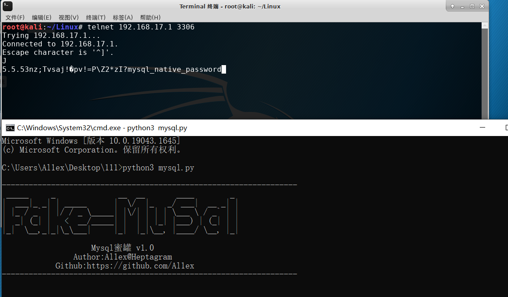

## 项目介绍
MysqlHoneypot是一个Mysql蜜罐项目，主要借助load data local infile来获取攻击者主机(Windows平台)的用户名，并根据用户名进一步获取微信ID，之后根据微信ID获取用户的手机号码，登录地址等信息，主要读取的文件如下：
- 通过C:/Windows/PFRO.log获取windows用户名 

- 通过C:/Users/用户名/Documents/WeChat Files/All Users/config/config.data获取wxid 

- 通过C:/Users/用户名/Documents/WeChat Files/wx_id/config/AccInfo.dat获取地址、微信号、手机号

## 功能介绍
捕获攻击者PC端微信账户信息

## 使用示例
Step 1：攻击者外网扫描到资产，并进行暴力猜解

Step 2：攻击者本地PC安装微信的情况下首次直接读取PFRO.log和config.data文件

Step 3:攻击者再次尝试时获取AccInfo.dat信息

补充扩展：
- 非Windows系统连接时不会获取信息，如有需要可以自我改动文件中要读取的内容

- 攻击者本地未安装微信时只读取PFRO.log

## 不足之处
当攻击者使用暴力猜解工具成功爆破(假象)并远程登录时，首次会获取到PFRO.log、config.data文件内容，如果要获取更加纤细的内容需要攻击者再次尝试连接(一般都会尝试)，关于这一点后期有空再改改看

## 参考连接
https://github.com/qigpig/MysqlHoneypot
https://github.com/heikanet/MysqlHoneypot
https://mp.weixin.qq.com/s/rQ9BpavBeMnS6xUOidZ5OA
https://mp.weixin.qq.com/s/m4I_YDn98K_A2yGAhv67Gg