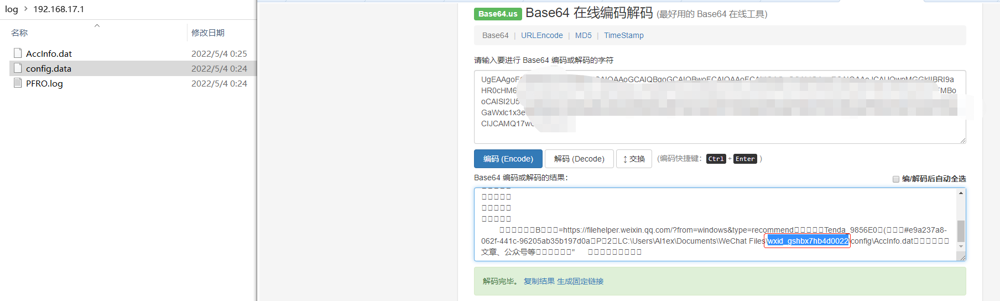

## Introduction
MysqlHoneypot is a Mysql honeypot project, which mainly uses load data local infile to obtain the user name of the attacker's host (Windows platform), and further obtains the WeChat ID according to the user name, and then obtains the user's mobile phone number, login address and other information according to the WeChat ID. The main files read are as follows:

**A、Via C: / Windows / pfro Log to get attacker's name** 

**B、Via C:/Users/UserName/Documents/WeChat Files/All Users/config/config.data get attacker's wxid**

**C、Via C:/Users/UserName/Documents/WeChat Files/wx_id/config/AccInfo.dat get address、wechatID、Telephone**

## Function
Capture the attacker's PC WeChat account information

## Usage examples
Step 1：The attacker's extranet scans the assets and guesses violently.

Step 2：The local PC of the attacker directly reads PFRO.log and config.data files for the first time when WeChat is installed.

Step 3:The attacker obtains AccInfo.dat information when trying again.

Supplementary expansion：
- Windows will not get information when it is not connected to the system. If necessary, you can change what you want to read in the file.

- The attacker only reads PFRO.log when WeChat is not installed locally.

## Shortcomings
When an attacker uses the brute force guessing tool to successfully explode (fake) and log in remotely, he will get the contents of PFRO.log and config.data files for the first time. If he wants to get more delicate contents, he needs to try to connect again (usually). Please change this later when you have time.

## Reference
https://github.com/qigpig/MysqlHoneypot

https://github.com/heikanet/MysqlHoneypot

https://mp.weixin.qq.com/s/rQ9BpavBeMnS6xUOidZ5OA

https://mp.weixin.qq.com/s/m4I_YDn98K_A2yGAhv67Gg
